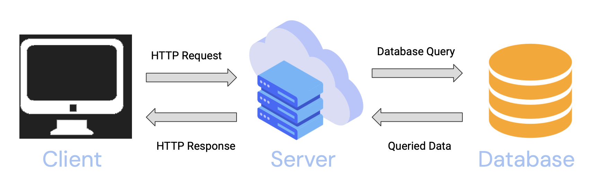

# Week 4: Building APIs with Express.js

## What is Express?
[Express](https://expressjs.com) is a web application framework for Node.js that enables developers to start a local server and develop API routes. Express does
a good job of abstracting away the complexity of serving a web application. Before we explore Express, some background on the Internet and APIs is helpful!

## Background on the Internet

Before we explore Express.js, some background information on how servers work is necessary.

### How the Internet works

The internet can be thought of as a really, really long wire. Computers all over the world can interact with one another via this wire.
In prior chapters, we mentioned the idea of **clients**. Web **clients** are the users (technically, web browsers, like Chrome or Safari).
These clients request data through this long wire from web **servers**, which are simply any computers that serve data to client.

The standard of this client/server communication is a protocol known as HTTPS (Hypertext Transfer Protocol). This is a "language" that both 
clients and servers can speak.

### HTTP Requests

We mentioned earlier that clients can request data from servers across the internet. This is accomplished with an HTTP Request, which is just
a way of telling the server what the client would like to do. There are four common HTTP methods:

- `GET`, for retrieving a resource from the server
- `POST`, for posting or adding a resource to the server
- `PUT`, for editing or modifying an existing resource on the server
- `DELETE`, for deleting an existing resource on the server

Together, these four methods give any application **CRUD functionality**–Create, Read, Update, Delete. Take a look at your favorite applications, and you'll be structured
to notice that all of them support some form of CRUD.

There are more [HTTP methods](https://developer.mozilla.org/en-US/docs/Web/HTTP/Methods), but the above four are the most common ones you'll see.

### HTTP Responses
For every request, there must be a response. Servers can respond to requests through an HTTP response. These responses have status codes tied to them, to indicate
to the client whether the request was successful, and any specific information if it was unsuccessful. You've definitely seen these before! Have you ever tried to buy tickets to an event,
but encountered a `500` (internal server error), or clicked on a link to be met with a `404` (resource not found error)?

Status codes are 3 digit numbers that are classified according to success level, client errors, server errors, etc. You can see a comprehensive list
of them [here](https://developer.mozilla.org/en-US/docs/Web/HTTP/Status)!

### Web application architecture

Ultimately, this is a standard web application architecture:



As we mentioned before, clients communicate with servers via HTTP requests and responses. When those requests and recieved and processed,
the server may make database queries to provide actual data for the client to use.

## APIs
Although there exists a standard for communication (HTTP), every server interacts differently. Imagine trying to `GET` a song from Spotify's servers, and then
attemping to `GET` a movie from Netflix's servers. While both requests are attempting to retrieve a resource, the way that one might ask for each differs. This is where 
**APIs** come into play. 

API stands for **A**pplication **P**rogramming **I**nterface. An API is simply a toolkit for a client to interact with. Every server is different and accomplishes different goals 
through the use of this toolkit. APIs provide a framework and standard for how clients can interact with any given server.

A good analogy for APIs is that of a waiter in a restaurant. The tables and dining area is the client, where the customers send requests for food to the kitchen (Requests), which is the backend. The kitchen is responsible for creating
the food and sending it back to the dining area (Responses). How is this communication done? Through the waiters and waitresses! APIs are similar to waiters and waitresses, since they're the middlemen responsible for requests making it to the back-end, and 
responses making it back to the client.


Generally, APIs provide API Routes, which are specific routes on a server that HTTP requests can be sent to. This allows clients to figure out how to interact with a particular server and request
a certain set of resources. API routes have the following syntax:

```
http://localhost:5000/api/purchases

```

The same API route can be used for various HTTP methods. For example, a GET request sent to this route might return all purchases, while a POST
request sent to this route (with a request body) would post a new purchase.

Let's see this in action with the Spotify API. Many enterprise APIs have comprehensive documentation, allowing developers to easily develop applications that can consume these APIs.


## Building our own APIs with Express

Now that we have a background on what APIs are and how we interact with them, we can discuss how Express enables developers to build their own APIs.


